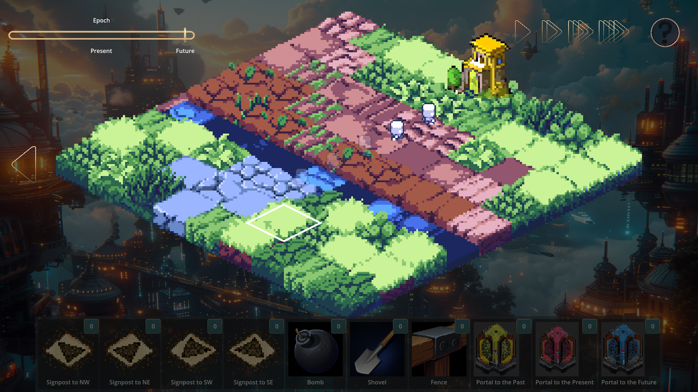
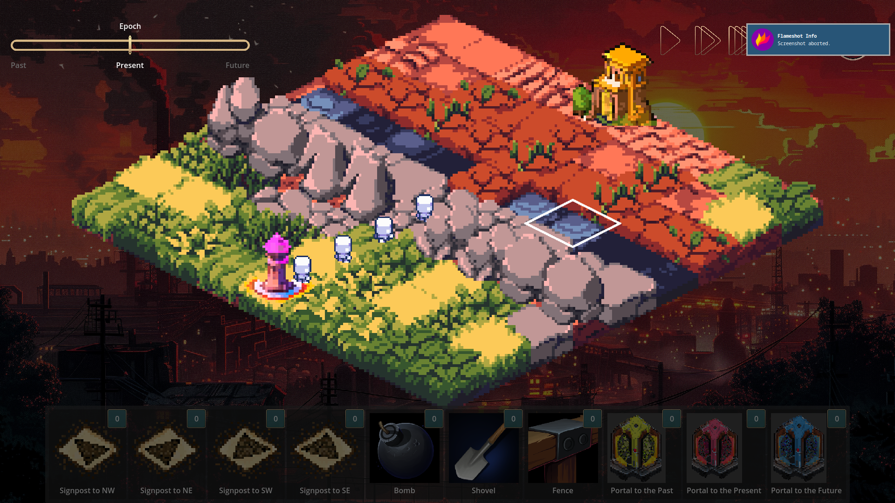

# Chronominions

This isometric puzzle game challenges players to navigate their minions through a changing landscape by manipulating time and using various tools. Can you safely guide your minions through all 12 levels without any of them dying?

## [Player Online Now!](https://brutenis.net/chronominions)

- **Time Manipulation**: Use the `Epoch` slider to shift between the **Past**, **Present**, and **Future**, altering the environment to solve puzzles.
- **Tools & Items**:
  - **Signposts**: Direct paths (e.g., NW, NE, SW, SE).
  - **Bombs**: Clear obstacles.
  - **Shovels**: Modify the terrain.
  - **Fences**: Block paths.
  - **Portals**: Transport between the Past, Present, and Future to move your minions through time.
- **Dynamic Terrain**: The backgrounds change as you shift through time. Travel to the lush jungles of the past, the industrial wastes of the present or the utopian cities of the future.

## Licenses

Tileset: https://scrabling.itch.io/pixel-isometric-tiles/download/eyJleHBpcmVzIjoxNzExMTM4MjU4LCJpZCI6MTUwMzAxMH0%3d%2ex5TUR%2fPWAEmeV4VN0tdSjCLNzBk%3d
Character: https://axulart.itch.io/small-8-direction-characters
